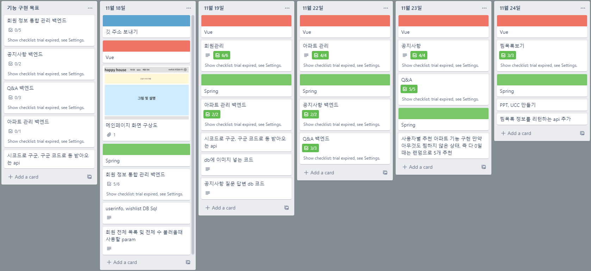
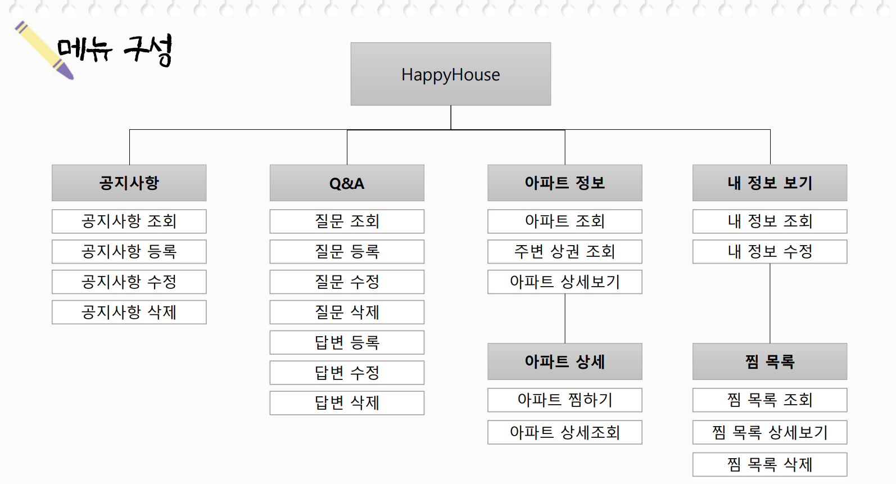
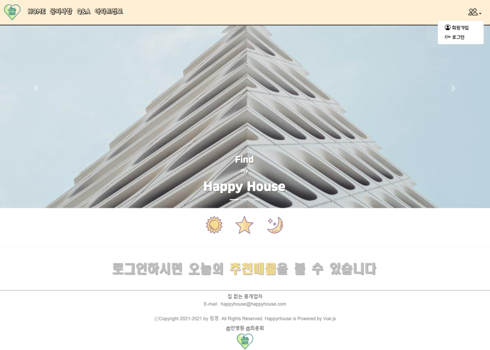
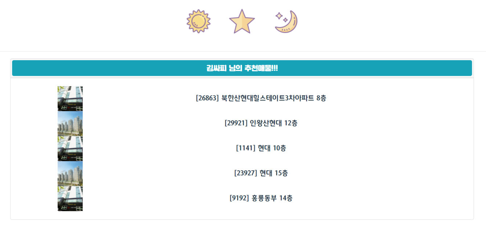
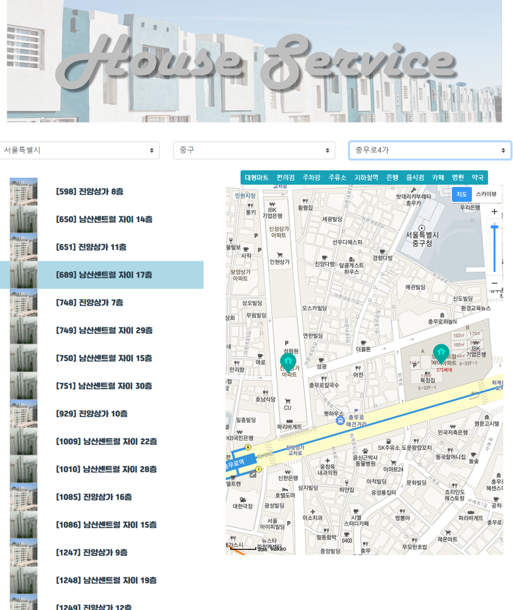
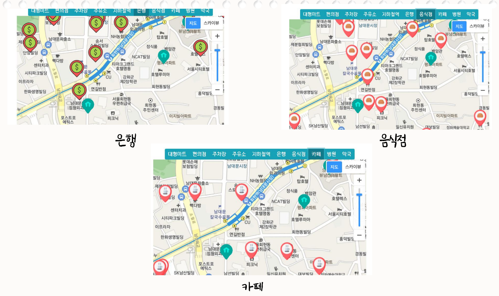

## 개요
SSAFY 1학기 최종프로젝트, 내 집 마련에 도움을 주는 부동산 사이트

## 차별점
사용자가 찜한 목록을 분석해 5개의 매물을 추천  
해당 매물 근처의 주변 상권 정보를 표시  

## 역할
### 안영원
1. 데이터베이스 설계 및 관리
2. Spring Boot를 이용한 RESTApi 구현
3. 카카오맵 API 적용 및 활용
4. 아파트 정보 페이지 구성

### 최윤희
1. vue를 통한 화면 구성
2. CSS 수정 및 적용
3. 유저정보, 공지사항, QnA 구현

## 사용 기술
1. Spring Boot(2.6.2) with JAVA
2. Vue2 with JS
3. MySQL(8.0.26), MyBatis
4. BootstrapVue

## 진행 일정 (2021.11.18 ~ 2021.11.24) 주말 제외 총 5일
|일정|내용|
|---|---|
|11/18| 메인페이지 구상, 회원정보 관리 API 구현|
|11/19| 로그인, 로그아웃, 마이페이지 제작, 아파트 관리 API 구현|
|11/22| 아파트 관리 페이지 제작, 공지사항, QnA API 구현|
|11/23| 공지사항 및 QnA 페이지 제작, 지도 페이지 제작 후 카카오맵 API 적용|
|11/24| 찜목록 제작 및 CSS 적용|

진행시에는 아래와 같이 Trello를 활용해서 관리하였습니다.

## 메뉴 구성
페이지의 메뉴는 다음과 같이 기획하고 구성하였습니다.

---

## 영상으로 한 눈에 보기
https://youtu.be/9RfEC2mGzTg

---

## 주요 기능 사진으로 보기
## 추천 매물 리스트

로그인이 되어있지 않으면 추천매물을 확인 할 수 없음  

하단에 위와 같이 추천 매물이 생성  
  
## 주변 상권 보기
  
해당 페이지 우측에 지도에서 위쪽 버튼을 누르면 해당되는 상권 정보를 아래와 같이 표시  
  

---

## 기대효과
1. 구성된 웹페이지를 통해 사용자가 찾고자 하는 정보를 간편하게 검색
2. 추천 매물을 통해 자신에게 적합한 매물을 추천 받아 고민할 시간을 줄여줌
3. 선택한 매물의 주변 정보를 추가적으로 검색없이 간편하게 확인
4. 찜 해둔 매물을 추후에 확인하여 변동 사항을 확인

## 개발후기
1. 웹 개발에 대해 거의 무지한 상태였는데 이번 개발을 웹의 구성과 어떻게 개발을 해야하는지에 대한 부분을 배웠습니다.
2. Vue의 기본적인 사용법과 BootStrap을 이용한 디자인 적용에 대해 학습하였습니다.
3. Spring에서 Spring Boot를 이용해 개발하는 것에 대해 학습하였고 추가적으로 MyBatis를 이용한 DB 작업을 배웠습니다.
4. Swagger를 통해 상세하게 API를 작성해 프론트와 공유하는 법에 대해 학습하였습니다.
